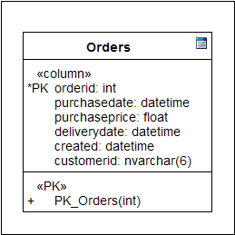
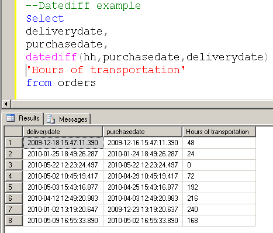

# Utilizando las funciones de fechas (Date functions) de SQL Server
    

Los cálculos con fecha son comunes en la mayoría de las aplicaciones que usan bases de datos, estos cálculos se utilizan en: fechas de vencimientos, cálculos de interés, cumpleaños o el número de días que alguien ha estado en el hospital.
 

 

 Las funciones de fechas de SQL Server realizan conversiones automáticamente de los tipos CHAR o VARCHAR a los tipos DATETIME o SMALLDATETIME según sea el caso.
 Para mostrar ejemplos con las funciones de fecha SQL utilizare una tabla con el siguiente diseño:
    

    
<b>Fig 1. El diseño de la tabla para los ejemplos</b>
 

 

Algo importante que debe tenerse en cuenta, es que SQL Server trata cualquier fecha con dos dígitos en el año si son menores a 50 como años del siguiente siglo. Ejemplo:

<b>Fig 2. Fecha de dos dígitos menor a 50 años.</b>
 

 

Y a las fechas con los dos dígitos en el año mayores a 50 como años del siglo actual. Ejemplo:

<b>Fig 3. Fecha de dos dígitos mayor a 50 años.</b>
 

 

Debido a esto, para evitar problemas en las operaciones siempre es recomendable trabajar las fechas con 4 dígitos, como lo muestro en los siguientes ejemplos.  

<b>Fig 4. Fecha de cuatro dígitos menor a 50 años.</b>
 

 

<b>Fig 5. Fecha de cuatro dígitos mayor a 50 años.</b>
 

 
<h3>Las funciones de fecha</h3>

Antes de trabajar con las funciones de fechas es necesario entender los componentes de los tipos de dato fecha.

<b>Fig 6. Las partes del tipo de dato fecha.</b>
 
 

 

Bien a continuación muestro los ejemplos con las funciones de fecha.

<h3>La función DATEADD</h3>

Esta función permite agregar un intervalo de tiempo a una fecha para obtener la suma del intervalo de tiempo y la fecha a la que se le aplica la función. Por ejemplo 

    
<b>Fig 7. Ejecutando la función para agregar 8 horas a la columna deliverydate.</b>
 
    

 
    <h3>La función DATEDIFF</h3>
    
Esta función regresa la diferencia entre dos fechas según la parte de la fecha que se especifique. Ejemplo:

    
<b>Fig 8. Ejecutando la función obtener la diferencia en horas entre purchasedate y deliverydate.</b>
 
    

 
    <h3>La función DATENAME</h3>
    
Esta función regresa una cadena representando el nombre de la parte de la fecha que se especifique. Ejemplo:

    
<b>Fig 9. Ejecutando la función para obtener el nombre del día de la semana y el mes del año.</b>
 
    

 
    <h3>La función DATEPART</h3>
    
Este función regresa el valor entero de la parte de la fecha que se especifique. Ejemplo:

    
<b>Fig 10. Ejecutando la función para obtener el valor entero del día del año.</b>
 
    

 
    <h3>La función GETDATE</h3>
    
Esta función regresa la fecha y la hora actual del servidor. Ejemplo:

    
<b>Fig 11. Obteniendo la fecha y la hora actual.</b>
 
    

 
    <h3>Las funciones DAY, MONTH, y YEAR</h3>
    

      Estas funciones regresan el entero correspondiente de la fecha en la cual se aplique la función, en rigor de verdad estas funciones tienen su equivalencia con la función <b>DATEPART</b>, por ejemplo: la función <b>DAY</b> es equivalente a <b>DATEPART(dd,fecha)</b>, la función <b>MONTH</b> equivale a <b>DATEPART(mm,fecha)</b> y así lo mismo para la función <b>YEAR</b> que equivale a <b>DATEPART(yy,fecha)</b>.
    

